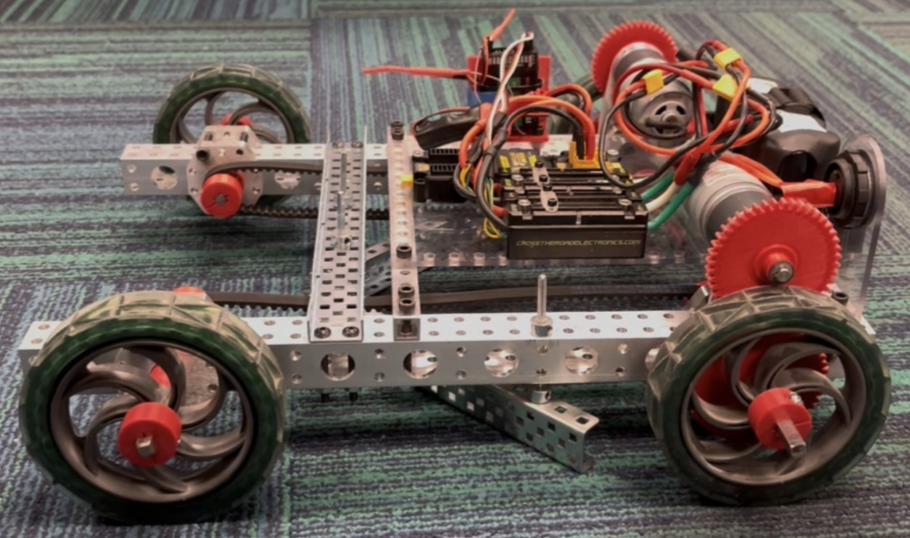
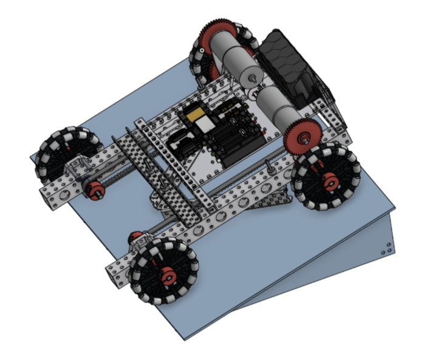
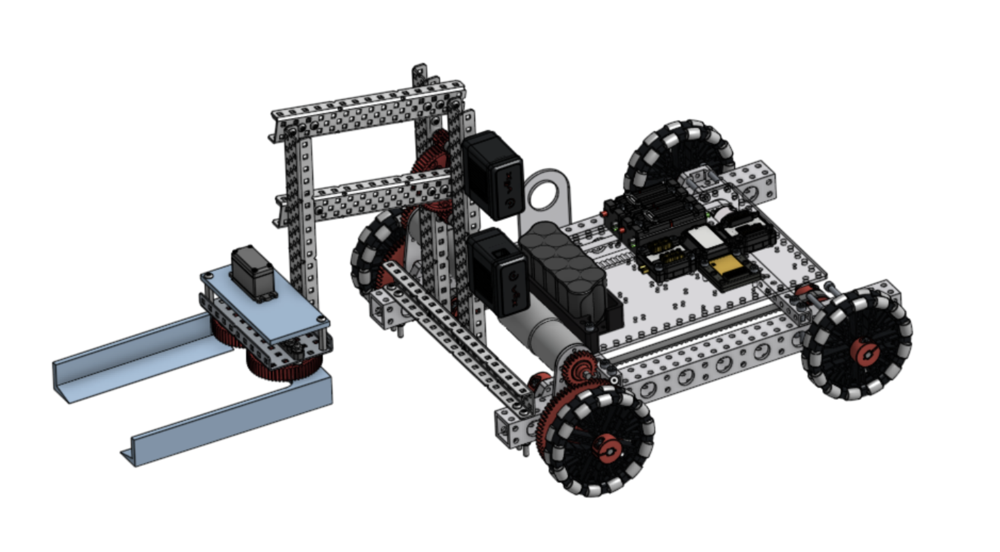

# Cornhole Robot

Competition robot for CMU 16-220 Robot Building Practices. The robot used a simple RC-controlled drivetrain, a passive bean-bag intake, and a custom ramp to score 15 cornhole bags in 4:29, earning 3rd place in class.

[Final robot demo](https://youtu.be/4ThMc63bv38)

## Embedded Systems Relevance

- Wired and soldered the robot power/control stack, including a 12V NiMH battery, XT-30 power distribution, motor controllers, voltage regulation, drive motors, and RC receiver.
- Integrated two independently controlled drivetrain motors through RC channels for differential/tank-style control.
- Tuned controller power limits to 80% for smoother low-speed control while climbing and descending the ramp.
- Debugged electromechanical reliability issues where drivetrain torque, gear ratio, wiring layout, center of mass, and driver visibility affected system performance.

## Design Overview

The final design separated the system into three main subsystems:

- **Drivetrain:** VEX/goBILDA-style chassis powered by two NFP-GA36Y-555 DC motors, with a 44:55 gear ratio and timing belts linking the rear wheels.
- **Passive intake:** A floating V-shaped claw made from C-channel, axles, and shaft collars. The compliant mounting let the claw adapt to bean-bag shape and ramp angle without adding servos or extra control channels.
- **Ramp:** A 14 in x 21 in x 4 in hardboard ramp with a 15.5 degree incline, built to sit flush with the game board and provide repeatable traversal.

## Prototype Iteration

Before the final passive intake, I built and tested a powered claw concept as a stepping stone for understanding bean-bag manipulation. That prototype showed that the bag could be controlled reliably from the sides, but the servo/four-bar approach added unnecessary actuator complexity and control overhead. Those findings led to the simpler floating passive claw used in the final robot.

[Powered claw prototype demo](https://youtu.be/aDz2mZCN5AU)

## Key Results

- Scored 15 bean bags in 4 minutes 29 seconds during the final competition run.
- Achieved repeatable single-bag pickup with a passive mechanism and no missed pickups in final testing.
- Reduced control complexity by eliminating the originally planned powered claw/four-bar mechanism.
- Iterated from failed wheg-based climbing prototypes to a simpler ramp-based architecture after testing torque, traction, and stability limits.
